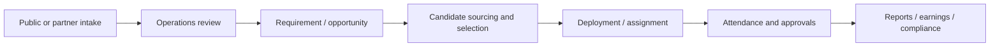

# Product Overview

## What ZOBHUNGER is

ZOBHUNGER is an integrated workforce, sales and business-execution platform. The application combines a public corporate website with authenticated operational portals used to receive workforce requirements, manage candidates, coordinate deployments and attendance, work with institutional partners, onboard employees, administer compliance, and support workers through jobs, assignments and earnings.

The product is broader than a recruitment website. Recruitment is one intake channel; the operational model continues through selection, deployment, attendance, reporting and selected HR/compliance workflows.

## Product surfaces

### Public website
The public Next.js website explains services and industries, publishes jobs and articles, captures enquiries and workforce requirements, and provides intake forms for careers, internships, business partners, vendors, placement cells and technical institutes.

### Business portal
Approved business users maintain their company profile, submit and manage workforce requirements, follow linked openings, review shared candidates, inspect deployments and attendance, approve attendance where applicable and download operational reports.

### Worker portal
Workers maintain a profile and private resume, discover jobs, save and apply to opportunities, view assignments, submit attendance-related actions and review approved earnings statements.

### Placement-cell portal
Placement partners manage candidates, discover opportunities and submit applications for managed candidates.

### Technical-institute portal
ITI/polytechnic-style institutional partners manage verified students, view opportunities, create applications and use reporting views. Matching is bounded and performed on demand rather than hydrating every student for every opportunity list.

### Admin and departmental operations
Administrative users review intake, requirements, candidates, jobs, deployments, attendance, worker workflows, partners, vendors, careers, internships, employee joining, PF/ESIC compliance, articles and AI-assistant knowledge. Department access is permission-scoped rather than relying on frontend hiding.

## Main operating lifecycle

Not every feature uses every stage. For example, vendor and blog workflows have their own review lifecycle, while worker job applications join the workforce flow at candidate/application stages.

## Product principles reflected in the code

- One versioned backend API is shared by public pages and authenticated portals.
- PostgreSQL is the system of record.
- Private portal data is not treated as public cacheable content.
- Critical write workflows use validation, authorization and duplicate/race protections.
- HR and payment workflows receive stronger confidentiality and integrity controls than ordinary public content.
- Operational functionality should remain usable when non-essential cache infrastructure is unavailable.
