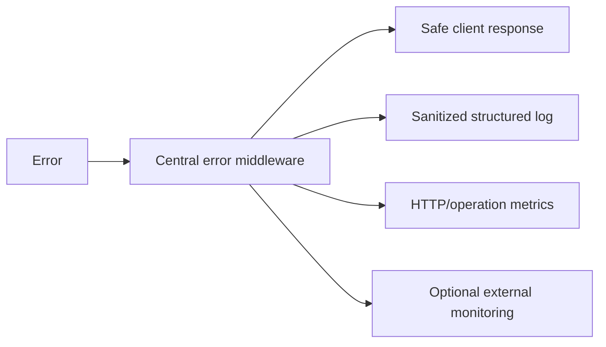

# Request Lifecycle

## Public reads

Public reads such as jobs and published articles enter the Express API through `/api/v1`, receive request context and global rate limiting, are validated where parameters exist, then use domain services/repositories. Cacheable read-heavy data may use Redis through a bounded fallback layer.

## Authenticated reads

Portal reads require the appropriate authenticated role. Responses containing private portal information use `Cache-Control: no-store`; portal pages are also protected against search indexing by the frontend production configuration.

## Authenticated writes

Portal writes use the `portalWrite` guard, which requires a browser request shape that cross-site HTML forms cannot trivially reproduce and relies on the configured CORS allowlist. Domain routes add role/permission checks and Zod validation.

## Request IDs

`request-context.middleware.ts` attaches a request ID used in structured logs and selected notifications/diagnostics. Request log targets are sanitized before being recorded so query credentials and token-bearing URLs are not copied into logs.

## Timeouts

- Browser API calls use a shared default timeout for ordinary requests.
- Uploads and exports receive longer bounded timeouts.
- Streaming chatbot requests are handled as a deliberate long-lived exception.
- Provider clients such as Cashfree, Resend, Cloudinary, Groq, Gemini and error monitoring have their own server-side timeouts.

## Compression

The API applies response compression for eligible payloads using the shared response-compression middleware. Payloads that should not be compressed or do not benefit from it can bypass compression according to middleware logic.

## Failure path

Production responses do not expose raw stack traces or provider secrets.
