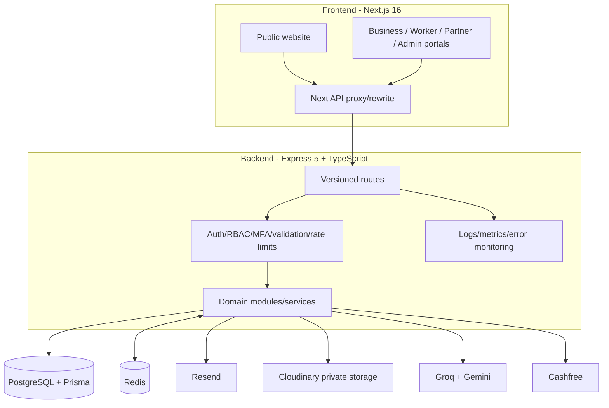

# System Architecture

## Logical architecture

## Deployment boundary

The intended production topology is a separately deployed frontend and API, with Vercel-style hosting for Next.js and Render-style hosting for the Node API documented by the repository's release checks. PostgreSQL, Redis and external providers remain network dependencies of the API.

The frontend and backend expose build/revision information used by production checks to detect mismatched deployments.

## Module boundaries

The backend is organized by domain under `server/src/modules/`. Modules include authentication, admin access, business, workers, requirements, candidates, deployments, attendance, placement cells, technical institutes, employee joining, compliance, partners, vendors, careers, internships, payments, articles, chatbot and telemetry.

Shared cross-cutting code lives in:

- `server/src/middlewares/` for request/security policies;
- `server/src/services/` for email, storage and reusable provider logic;
- `server/src/observability/` for metrics/error reporting;
- `server/src/config/` for environment, database, Redis and CORS configuration;
- `server/src/utils/` for response/error/JWT/password/logging utilities.

## Source-of-truth boundaries

- PostgreSQL: durable application state.
- Redis: cache, distributed operational counters and transient acceleration. It is not the authoritative business record.
- Cloudinary: private binary documents referenced by database records.
- Email/provider systems: delivery/external execution, not authoritative workflow state.
- `server/src/modules/chatbot/knowledge/`: checked-in public knowledge corpus for the assistant; managed knowledge also has database records.
