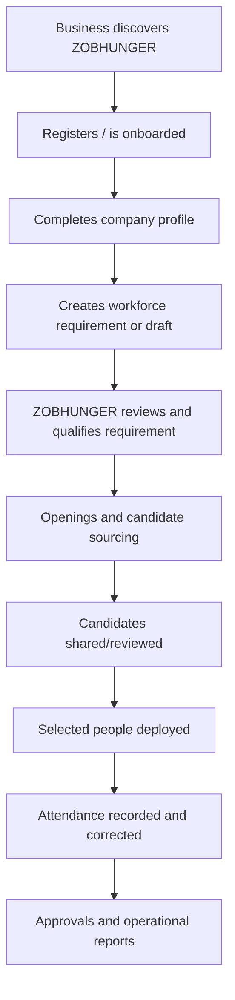
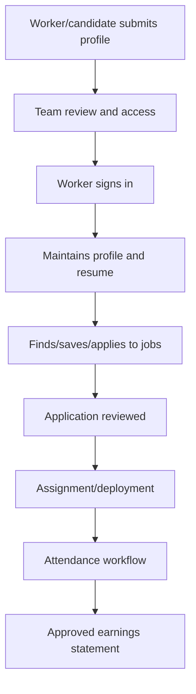
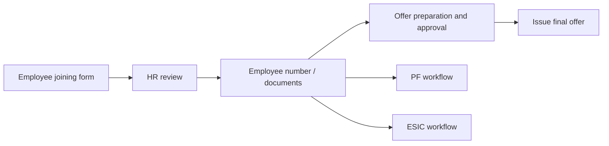

# System Flow (Non-Technical)

This document explains how work moves through ZOBHUNGER without describing controllers, databases or code internals.

## 1. Business workforce flow

A business can save incomplete requirements as drafts. Submitted requirements become operational records. Administrators can qualify the requirement and connect hiring openings. Candidate review, deployments and attendance remain tied back to the operating context rather than existing as isolated spreadsheets.

## 2. Worker flow

Workers see only their own portal data. Earnings administration happens on the operations side and approved statements become visible to the worker.

## 3. Placement-cell flow

1. Institution applies for a partnership.
2. ZOBHUNGER reviews and activates access.
3. The placement cell maintains its candidate roster.
4. It browses available opportunities.
5. It searches/selects a managed candidate and submits an application.
6. Application status can be followed in the portal.

Candidate and opportunity lists are paginated so growth does not turn the portal into an accidental bulk export.

## 4. Technical-institute flow

1. Institute applies/receives access.
2. Student records are added or imported and verified.
3. The institute browses technical opportunities.
4. Matching is calculated when needed using eligibility filters and bounded candidate scanning.
5. Applications are submitted and tracked.
6. Reports provide operational views without loading an unlimited student roster.

## 5. Employee joining and compliance

Sensitive identity, banking and compliance information is treated as private HR data. PF and ESIC have separate permission areas so access can be divided between departments.

## 6. Public intake flows

The public website has separate intake paths for contact enquiries, workforce requirements, careers, internships, partners, vendors, placement cells and technical institutes. Admin intake and review surfaces consolidate these into operational workflows while preserving the source/type of each record.

## 7. Content and assistant flow

Administrators publish articles through the blog CMS. The public AI assistant answers from managed ZOBHUNGER knowledge, can provide official links and selected authenticated tools, and is designed to refuse unsupported answers rather than invent company facts.
