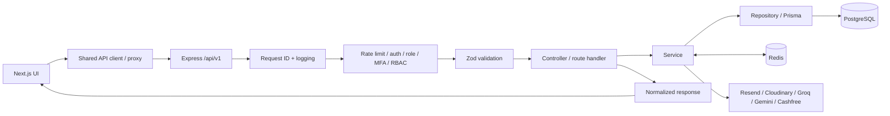
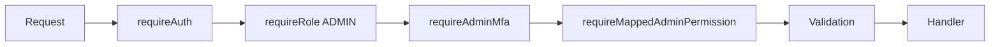

# Technical Flow

## Browser-to-database path

Not every route uses every stage. Public read routes may omit authentication. Provider calls are only used by the feature that needs them.

## Write request flow

Authenticated portal writes normally include:

1. browser sends credentials and `X-Requested-With: XMLHttpRequest`;
2. request context assigns/propagates a request ID;
3. CORS and portal-write protections reject inappropriate cross-site writes;
4. role/permission middleware authorizes the actor;
5. Zod schemas validate path/query/body data;
6. service code applies domain rules and revisions/idempotency where required;
7. Prisma transaction/query persists the change;
8. related cache generations are invalidated when necessary;
9. audit/operational events are written where the domain requires them;
10. response uses the common API envelope and private responses remain `no-store`.

## Admin request flow

`/api/v1/admin/*` is intentionally stricter:

The permission mapper is fail-closed for protected admin route families. Adding a new admin family therefore requires explicitly assigning its permission behavior.

## File flow

Uploads are size/MIME/signature checked by feature-specific handlers. Private Cloudinary downloads are delivered through short-lived authenticated URLs rather than public asset URLs.

## Error/telemetry flow

Errors are normalized centrally. Structured logs sanitize request targets and sensitive context before output. Operational counters track request volume, error classes and latency buckets. Optional external error monitoring receives sanitized diagnostics, not raw secrets or production stack traces.
