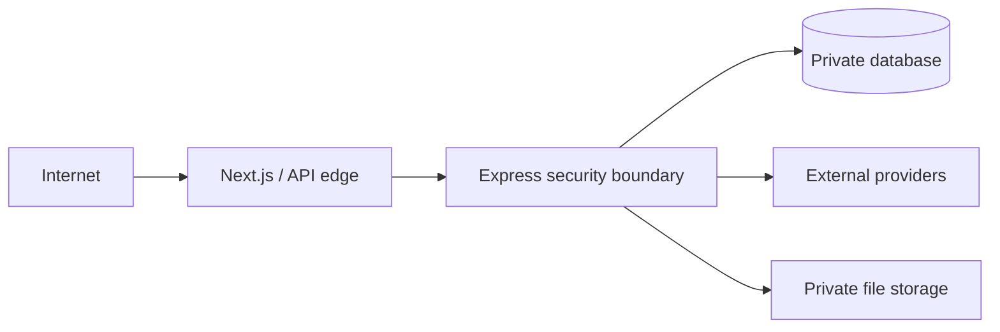

# Security Architecture

Security is layered; no single middleware or provider is treated as sufficient.

## Main controls

1. **Environment validation**: production startup rejects missing/unsafe critical configuration.
2. **HTTP hardening**: Helmet, strict CORS allowlist, production HTTPS assumptions, body-size limits.
3. **Authentication**: Argon2id passwords, signed scoped JWT, HttpOnly secure cookie.
4. **Authorization**: role middleware plus fail-closed admin permission mapping.
5. **Admin MFA**: mandatory for production admin access.
6. **Input validation**: Zod route/query/body schemas and upload validation.
7. **Write protections**: portal-write/origin-style checks and rate limits.
8. **Data protection**: AES-GCM HR PII encryption and private document storage.
9. **Payment integrity**: idempotency/reconciliation plus raw-body webhook signature verification.
10. **Logging safety**: sensitive URL/context redaction and production-safe errors.
11. **File security**: MIME/magic-byte/size checks, bounded parsers and private authenticated storage.
12. **Operational limits**: provider budgets, circuit breakers, export/matching ceilings and timeouts.
13. **CI security**: secret scan, runtime-aware dependency audit, CodeQL and regression gates.

## Trust boundaries

Do not trust frontend validation, provider redirect parameters, user filenames, public query tokens or an `ADMIN` role alone.

## Current known operational exclusion

Database backup/restore/PITR implementation is deliberately not part of the current hardening patches. It remains an operational requirement to implement and test separately rather than being falsely documented as complete.
